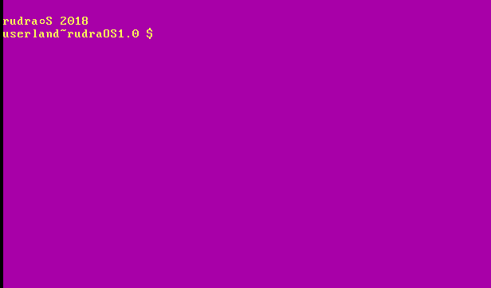

# rudraOS
### An x86 operating system built from scratch in Assembly
This is an x86 operating system built from scratch in Assembly. Licensed by Rudra Saraswat of BlueFire, Inc.
This OS has a shell named tash. The OS has 1 command and a few executables.

## Minimum Build Requirements
###### RAM - 1 GB (Recommended - 2 GBs or more)
###### Hard Disk Space - 1 GB (Estimated)
###### Processor - Any x86 or x64 based processor
###### Operating System - Debian, Ubuntu (or any other Ubuntu-based distro)

## New features
###### rOSVs (rudraOS Variations) have been introduced.
###### It has an about program that has specifications of the operating system.

